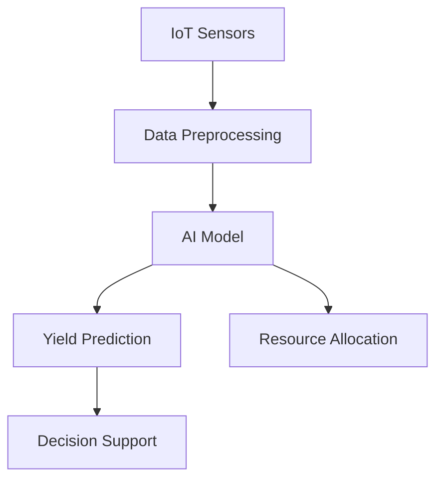

# Advanced AI Systems: Edge Computing and Quantum AI Assignment

## Overview
This repository contains a comprehensive exploration of cutting-edge AI technologies, focusing on Edge AI and Quantum AI approaches through theoretical analysis and practical implementation.

## Repository Structure
- `/docs/`: Documentation and reports
- `/src/`: Source code for implementations
- `/models/`: Trained AI models
- `/data/`: Datasets and sample data

## Part 1: Theoretical Analysis 📚

### Essay Questions

#### Q1: Edge AI - Latency and Privacy Optimization
**Objective**: Analyze the advantages of Edge AI in reducing computational overhead and enhancing data privacy.

**Key Exploration Points**:
- Latency reduction mechanisms
- Privacy preservation techniques
- Real-world application (Autonomous Drone Scenario)

#### Q2: Quantum AI vs Classical AI in Optimization
**Objective**: Compare quantum and classical AI approaches to complex optimization problems.

**Focus Areas**:
- Computational complexity
- Quantum algorithm advantages
- Potential industry transformations

## Part 2: Practical Implementation 🖥️

### Task 1: Edge AI Prototype - Recyclable Item Classifier

#### Tools
- TensorFlow Lite
- Raspberry Pi / Google Colab

#### Implementation Steps
1. Data Collection
2. Model Training
3. TensorFlow Lite Conversion
4. Performance Evaluation

**Deliverables**:
- Trained TensorFlow Lite Model
- Comprehensive Performance Report
- Deployment Documentation

#### Performance Metrics
- Accuracy
- Model Size
- Inference Time

### Task 2: AI-Driven IoT Agriculture Simulation

#### System Components
- **Sensors**:
  - Soil Moisture
  - Temperature
  - Humidity
  - Light Intensity

#### AI Model Requirements
- Crop Yield Prediction
- Resource Optimization
- Anomaly Detection

#### Data Flow Architecture


## Getting Started 🚀

### Prerequisites
- Python 3.8+
- TensorFlow 2.x
- TensorFlow Lite
- Jupyter Notebook

### Installation
```bash
git clone https://github.com/yourusername/ai-systems-assignment.git
cd ai-systems-assignment
pip install -r requirements.txt
```

## Submission Guidelines 📝
1. Complete both theoretical and practical components
2. Include clear documentation
3. Demonstrate understanding of Edge and Quantum AI concepts

## Evaluation Criteria
- Theoretical Depth (40%)
- Implementation Quality (30%)
- Code Organization (15%)
- Presentation & Clarity (15%)

## Resources
- [TensorFlow Lite Documentation](https://www.tensorflow.org/lite)
- [Quantum Computing Primer](https://quantum.computing.resources)

